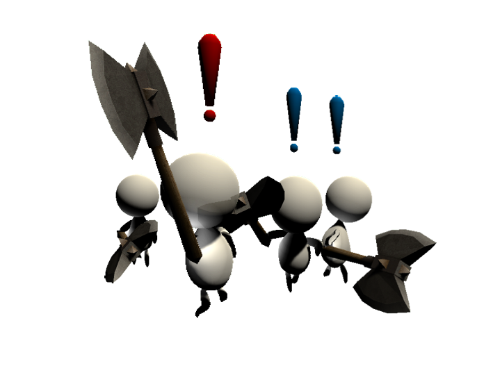

# Bonzo - The Dungeon Crawler 

  

# The Game

Bonzo - The Dungeon Crawler is a video game developed in Unity3D. The aim of the game is to break out of a dungeon with only crafting and subterfuge skills.

  

Find ways to get away building traps with what you find around. And use them to kill the ghost guards. Okay, they are actually already dead. But be careful!

  

Your adventure starts from here.

  

## LICENSE

The project uses assets taken from the Unity Asset Store, so in order to be available as a source it could be subjected to the [Standard Unity Asset Store EULA](https://unity.com/legal/as-terms).

Assets in use:
- [Stylized Hand Painted Dungeon (Free)](https://assetstore.unity.com/packages/3d/environments/stylized-hand-painted-dungeon-free-173934) by [L2S ARTS](https://assetstore.unity.com/publishers/46638)
